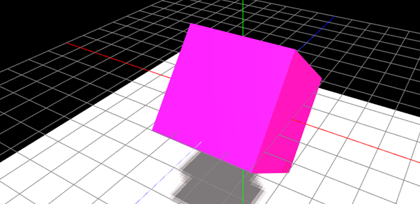
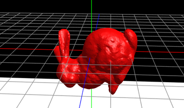
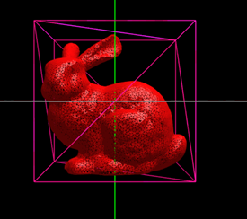
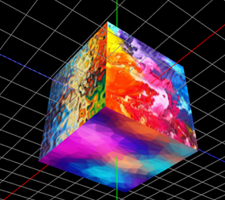

*White plane added for requirement 10
*For each event key, I have also included the JavaScript event keycode

REQUIREMENT 1:
Rendered cube should be seen on the screen

REQUIREMENT 2:
Coloured lines for each axis should be rendered onto screen

REQURIEMENT 3:

> Press 'x'- keycode 88 to rotate cube about the x-axis
> Press 'y'- keycode 89 to rotate cube about the y-axis
> Press 'z'- keycode 90 to rotate the cube about the z-axis
> Press 's'- keycode 83 to stop any of the above rotations
* These keys will rotate and stop the bunny model as well

REQUIREMENT 4:

*If the bunny is present on the scene and rendered using the edges
or vertices modes then the cube will also appear in the same mode, to
show that the bunny fits inside of it
> Press 'f'- keycode 70 to render cube in face mode
> Press 'e'- keycode 69 to render cube in edge mode
> Press 'v'- keycode 86 to render cube in vertices mode
> Press 'r'- keycode 82 to remove any of the above rendering modes
* These keys will render the bunny in different modes as well

REQUIREMENT 5:
> Press the 'left arrow'- keycode 37, to translate camera leftwards
> Press the 'right arrow'- keycode 39, to translate camera rightwards
> Press the 'up arrow'- keycode 38, to translate camera upwards
> Press the 'down arrow'- keycode 40, to translate camera downwards
> Press the number '1'- keycode 49, to translate camera fowards
> Press the number '2'- keycode 50, to translate camera backwards

REQUIRMENT 6:
Using mouse, to orbit about a point, initialised at center, press down and
drag mouse, similarly to orbital controls. The lookAt point is changed when a
translation key (requirement 5) is pressed. The camera will now orbit about this
new point. Please note that gimbal locking may occur when the camera is exactly
perpendicular to the z-axis (blue) at x=0, y=0.

REQUIREMENT 7:

> Press 't'- keycode 84 to apply the textures to the cube
> Press 'r'- keycode 82 to remove the textures

REQUIREMENT 8:
> Press 'b'- keycode 66 to add the bunny to the scene
* Note that unless the bunny is in edges/vertices mode, then this will remove
  the cube from the scene

REQUIREMENT 9:
*If the bunny is rendered using the edges or vertices modes
then the cube will also appear in the same mode, to show that
the bunny fits inside of it.
> Press 'x'- keycode 88 to rotate bunny about the x-axis
> Press 'y'- keycode 89 to rotate bunny about the y-axis
> Press 'z'- keycode 90 to rotate the bunny about the z-axis
> Press 's'- keycode 83 to stop any of the above rotations
------------------------------------------------------
> Press 'f', keycode 70 to render the bunny in face mode
> Press 'e'- keycode 69 to render the bunny in edge mode
> Press 'v'- keycode 86 to render the bunny in vertices mode
> Press 'r'- keycode 82 to remove any of the above rendering modes

REQUIREMENT 10:
White plane with shadows should be seen on screen, shadows made more evident with
different animations - rotations, bouncing, for both cube and bunny
> Press 'space'- keycode 32 to make the cube/bunny bounce across the screen
> Press 's'- keycode 83 to stop the bouncing
